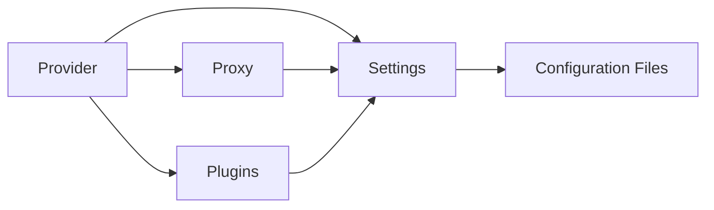
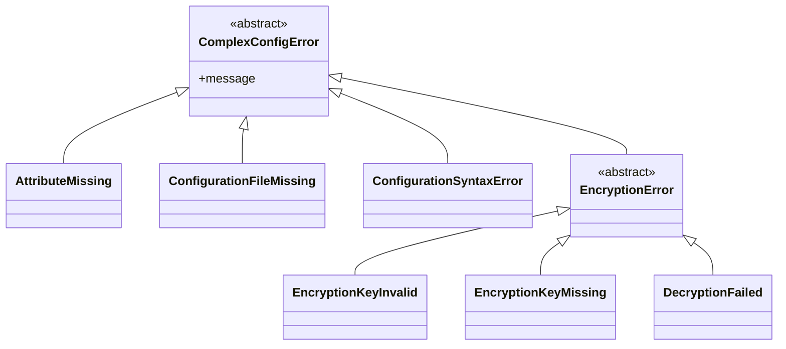

# ComplexConfig 🧠

## Description 📝

This library makes your YAML configuration files available via a nice API. It
also supports different configurations for each `RAILS_ENV` environment and
using plugins to return more complex settings values. 🚀

## Architecture Overview 🏗️

ComplexConfig follows a well-defined architectural pattern with clear
separation of concerns between several key components:

### Core Components 🧩

**Provider** (`ComplexConfig::Provider`)
- The central hub managing configuration loading, caching, and access 🔄
- Handles environment-specific configuration selection 🌍
- Manages plugin registration and execution 🔌
- Provides memoization for performance optimization ⚡

**Settings** (`ComplexConfig::Settings`)
- Represents structured configuration data with nested access 📊
- Implements dynamic attribute access through `method_missing` 🧠
- Supports conversion between different representations (hash, YAML, JSON) 🔄
- Provides deep freezing for immutability 🔒

**Proxy** (`ComplexConfig::Proxy`)
- Enables lazy evaluation of configuration access ⏳
- Defers loading until first method call 🚦
- Supports environment-specific lookups 🌐
- Handles safe existence checking ❓

### Component Interactions 🔄



The Provider acts as the main coordinator, loading configuration files and
creating Settings objects. The Proxy enables lazy loading, while Plugins can
augment or transform attribute values at runtime.

### Loading Mechanism 📥

ComplexConfig supports two primary access patterns if required via `require
"complex_config/rude"`:

1. **Environment-aware access** via `cc.config_name` (uses `RAILS_ENV` by
   default): 🌐

   ```ruby
   # Loads config/products.yml and applies environment-specific settings
   cc.products
   ```

2. **Explicit environment access** via `complex_config.config_name` (skips
   automatic environment namespace): 🧪

   ```ruby
   # Loads config/products.yml without environment prefix
   complex_config.products
   ```

The proxy system automatically resolves configuration file paths based on
method names, mapping `cc.products` to `config/products.yml`.

### Environment Prefix Behavior 🌍

When using the default `cc` accessor, ComplexConfig automatically applies
environment-specific configurations. For example, with a YAML file like:

```yaml
development:
  database:
    host: localhost
    port: 5432
production:
  database:
    host: db.production.example.com
    port: 5432
```

Accessing `cc.database.host` will return `"localhost"` in development and
`"db.production.example.com"` in production, automatically selecting the
appropriate environment section.

### Rails Integration 🚀

ComplexConfig integrates seamlessly with Rails application lifecycle. During
development, when Rails reloads classes (or the user types `reload!` into the
console), ComplexConfig automatically flushes its internal cache to ensure that
configuration changes are picked up correctly. This behavior is handled through
the Railtie integration which hooks into Rails' `to_prepare` callback.

### Caching Strategy 📦

ComplexConfig employs memoization through the `mize` gem to cache expensive
operations like file loading and parsing. In production environments, this
caching provides performance benefits, while in development, Rails' reloading
mechanism ensures configuration changes are respected.

### Design Patterns 🎯

- **Delegation**: Provider delegates to Settings for attribute access 🔄
- **Strategy Pattern**: Plugins provide different strategies for attribute
  resolution 🧠
- **Lazy Loading**: Proxy defers configuration loading until needed ⏳
- **Singleton**: Provider follows singleton pattern for consistent
  configuration access 🔁

This architecture enables flexible, performant configuration management while
maintaining clean separation between concerns.

## Installation 📦

You can use rubygems to fetch the gem and install it for you:

```bash
gem install complex_config
```

You can also put this line into your Gemfile

```ruby
gem 'complex_config', require: 'complex_config/rude'
```

and bundle. This command will enable all the default plugins and make the `cc`
and `complex_config` shortcuts available. The configurations are expected to be
in the `config` subdirectory according to the rails convention.

## Usage 🛠️

Given a config file like this and named `config/products.yml`

```yaml
development:
  flux_capacitor:
    version_20:
      name: Flux Capacitor Version 2.0
      price_in_cents: 12_000_00
      manual_pdf_url: "http://brown-inc.com/manuals/fc_20.pdf"
      components:
        - Miniature Chrono-Levitation Chamber (mCLC)
        - Single Gravitational Displacement Coil (SGDC)
        - Simple Quantum Flux Transducer (SQFT)
        - Basic Time-Space Navigation System (BTN)
    pro_version:
      name: Flux Capacitor Professional
      price_in_cents: 23_000_00
      manual_pdf_url: "http://brown-inc.com/manuals/fc_pro.pdf"
      components:
        - Advanced Chrono-Levitation Chamber (ACL)
        - Dual Gravitational Displacement Coils (DGDCs)
        - Advanced Quantum Flux Transducer (AQFT)
        - Professional Time-Space Navigation System (PTNS)
    enterprise_version:
      name: Flux Capacitor Enterpise
      price_in_cents: 1_600_000_00
      manual_pdf_url: "http://brown-inc.com/manuals/fc_enterprise.pdf"
      components:
        - Super-Advanced Chrono-Levitation Chamber (SACL)
        - Quadruple Gravitational Displacement Coils (QGDCs)
        - Ultra-Advanced Quantum Flux Transducer (UAQFT)
        - Enterprise Time-Space Navigation System (ETNS)
test:
  flux_capacitor:
    test_version:
      name: Yadayada
      price_in_cents: 6_66
      manual_pdf_url: "http://staging.brown-inc.com/manuals/fc_10.pdf"
      components:
        - Experimental Chrono-Levitation Chamber (ECLC)
        - Modular Gravitational Displacement Coils (MGDCs)
        - Variable Quantum Flux Transducer (VQFT)
        - Development Time-Space Navigation System (DTNS)
```

and using `require "complex_config/rude"` in the `"development"` environment
you can now access the configuration.

### Accessing configuration settings 📦

Fetching the name of a product:

```ruby
cc.products.flux_capacitor.enterprise_version.name # => "Flux Capacitor Enterpise"
```

If the name of configuration file isn't valid ruby method name syntax you can
also use `cc(:products).flux_capacitor…` to avoid this problem.

Fetching the price of a product in cents:

```ruby
cc.products.flux_capacitor.enterprise_version.price_in_cents # => 160000000
```

Fetching the price of a product and using the ComplexConfig::Plugins::MONEY
plugin to format it:

```ruby
cc.products.flux_capacitor.enterprise_version.price.format # => "€1,600,000.00"
```

Fetching the URL of a product manual as a string:

```ruby
cc.products.flux_capacitor.enterprise_version.manual_pdf_url
  # => "http://brown-inc.com/manuals/fc_enterprise.pdf"
```

Fetching the URL of a product manual and using the ComplexConfig::Plugins::URI
plugin return an URI instance:

```ruby
cc.products.flux_capacitor.enterprise_version.manual_pdf_uri
  # => #<URI::HTTP:0x007ff626d2a2e8 URL:http://brown-inc.com/manuals/fc_enterprise.pdf>
```

You can also fetch config settings from a different environment:

```ruby
pp cc.products(:test); nil
```

and output them.

```
products
└─ flux_capacitor
   └─ test_version
      ├─ name = "Yadayada"
      ├─ price_in_cents = 666
      ├─ manual_pdf_url = "http://staging.brown-inc.com/manuals/fc_10.pdf"
      └─ components
         ├─ "Experimental Chrono-Levitation Chamber (ECLC)"
         ├─ "Modular Gravitational Displacement Coils (MGDCs)"
         ├─ "Variable Quantum Flux Transducer (VQFT)"
         └─ "Development Time-Space Navigation System (DTNS)"
```

Calling `complex_config.products.` instead of `cc(…)` would skip the implicit
namespacing via the `RAILS_ENV` environment, so
`complex_config(:products).test.flux_capacitor` returns the same settings
object.

## Encryption Support in ComplexConfig 🛡️

ComplexConfig provides robust encryption capabilities for securing sensitive
configuration data, with built-in compatibility with Rails' secret encryption
system.

### Secure Configuration Files 🔐

The library supports encrypting YAML configuration files using AES-128-GCM
encryption. This allows you to store sensitive information like API keys,
passwords, and other secrets in your version control without exposing them in
plain text.

#### Basic Usage 🛠️

```ruby
# Write encrypted configuration
ComplexConfig::Provider.write_config('database', 
  value: { password: 'secret_password' }, 
  encrypt: :random
)
# => Returns the random 128-bit master key as hexadecimal string.
```

This creates `config/database.yml.enc` which contains the encrypted data and
returns the master key, which you can provide via an environment variable for
later read access.

#### Key Management 🔑

ComplexConfig supports multiple key sources in priority order:

1. **Explicit key setting**: Direct assignment via `config.key = 'your-key'`
2. **Environment variables**: `COMPLEX_CONFIG_KEY` or `RAILS_MASTER_KEY`
3. **Key files**: Files with `.key` extension alongside encrypted files
4. **Master key files**: `config/master.key` (Rails-compatible)

#### Rails Integration 🚀

ComplexConfig is fully compatible with Rails' secret encryption system:

```ruby
# Works seamlessly with Rails master.key
ENV['RAILS_MASTER_KEY'] = '0123456789abcdef0123456789abcdef' # Do not use this key.
# Encrypted files created by Rails can be read by ComplexConfig
```

#### Encryption Process 🔐

The system uses OpenSSL's AES-128-GCM cipher mode which provides both
confidentiality and authenticity. The encryption process:

1. **Marshals** the configuration object into binary format
2. **Encrypts** using AES-128-GCM with a randomly generated IV
3. **Authenticates** with an authentication tag to ensure integrity
4. **Encodes** all components in base64 and combines them with `--` separators

#### Security Features 🛡️

- **Authenticated Encryption**: Ensures data hasn't been tampered with
- **Secure Key Handling**: Validates key length requirements (16 bytes for
  AES-128)
- **Multiple Sources**: Flexible key management for different deployment
  scenarios
- **Atomic Writes**: Uses secure file writing to prevent corruption during
  encryption operations

This approach allows you to maintain sensitive configuration data securely
while keeping the same familiar YAML-based workflow that developers expect.

### Command-Line Interface and Encryption Management 🛡️

The `complex_config` executable provides a convenient command-line interface
for managing encrypted configuration files. This tool is particularly useful
when you need to securely store sensitive configuration data while maintaining
easy access during development and deployment.

#### Features ⚙️

- **Secure File Operations**: Encrypts/decrypts configuration files with
  automatic backup handling
- **Edit Support**: Opens encrypted files in your preferred editor (`EDITOR`
  environment variable or `vi` by default) 
- **Key Management**: Generates new encryption keys and supports key rotation
- **Atomic Writes**: Uses secure file writing to prevent data corruption

#### Usage Examples 📋

```bash
# Encrypt a configuration file
complex_config encrypt config/database.yml

# Decrypt a configuration file  
complex_config decrypt config/database.yml.enc

# Edit an encrypted configuration file
complex_config edit config/database.yml.enc

# Display decrypted content without writing to disk
complex_config display config/database.yml.enc

# Generate a new encryption key
complex_config new_key

# Recrypt a file with a different key
complex_config recrypt -o OLD_KEY -n NEW_KEY config/database.yml.enc
```

#### Security Considerations ⚠️

The script uses symmetric encryption for configuration files. When using
encrypted configurations:

1. **Key Management**: Store your encryption keys securely (never in version
   control)
2. **File Permissions**: Ensure encrypted `.enc` files have appropriate
   permissions
3. **Backup Strategy**: The `recrypt` command automatically creates backup
   files

#### Integration with ComplexConfig 🔗

When you use the `complex_config` executable, it works with the same encryption
mechanism that ComplexConfig uses internally for its encrypted configuration
files. This ensures consistency between your application's configuration
loading and your manual encryption/decryption workflows.

The tool is particularly valuable in development environments where you want to
maintain sensitive configurations without committing them to version control
while still being able to easily edit and manage them during development.

#### Environment Variables 📝

- `EDITOR`: Sets the preferred text editor for editing encrypted files
  (defaults to `vi`)
- `COMPLEX_CONFIG_KEY`: Can be set to provide a default encryption key

This command-line tool provides a bridge between secure configuration
management and practical workflow needs, making it easier to maintain encrypted
configurations without sacrificing usability.

## Debugging and Troubleshooting 🔍

ComplexConfig provides several built-in methods for inspecting and debugging
configuration data:

### Inspecting Configuration Structure 🧮

To see all available attributes and their values in a structured format:
```ruby
puts cc.products.flux_capacitor.enterprise_version.attributes_list
```

This outputs a representation showing all configuration paths and values listed
like this:

```
name = "Flux Capacitor Enterpise"
price_in_cents = 160000000
manual_pdf_url = "http://brown-inc.com/manuals/fc_enterprise.pdf"
components[0] = "Super-Advanced Chrono-Levitation Chamber (SACL)"
components[1] = "Quadruple Gravitational Displacement Coils (QGDCs)"
components[2] = "Ultra-Advanced Quantum Flux Transducer (UAQFT)"
components[3] = "Enterprise Time-Space Navigation System (ETNS)"
```

### Visual Tree Representation 🌲

For a more visual representation of the configuration hierarchy:

```ruby
puts cc.products.flux_capacitor.enterprise_version
```

This displays the configuration in a tree format:
```
products.flux_capacitor.enterprise_version
├─ name = "Flux Capacitor Enterpise"
├─ price_in_cents = 160000000
├─ manual_pdf_url = "http://brown-inc.com/manuals/fc_enterprise.pdf"
└─ components
   ├─ "Super-Advanced Chrono-Levitation Chamber (SACL)"
   ├─ "Quadruple Gravitational Displacement Coils (QGDCs)"
   ├─ "Ultra-Advanced Quantum Flux Transducer (UAQFT)"
   └─ "Enterprise Time-Space Navigation System (ETNS)"
```

These debugging methods are particularly useful during development when you
need to verify that your configuration files are loaded correctly and contain
the expected values.

## Error Handling ⚠️

ComplexConfig provides a comprehensive error handling system with specific
exceptions for different failure scenarios, following Ruby conventions for
predictable behavior.

### Exception Hierarchy 📚

The library defines a clear exception hierarchy that inherits from
`ComplexConfig::ComplexConfigError`:



### Error Scenarios 🚨

#### Configuration File Access 📁

When a configuration file is missing, `ConfigurationFileMissing` is raised.
This includes both regular `.yml` files and encrypted `.yml.enc` files:

```ruby
# Raises ComplexConfig::ConfigurationFileMissing if config/products.yml doesn't exist
cc.products.flux_capacitor.enterprise_version.name
```

#### YAML Syntax Errors 🧾

Invalid YAML syntax in configuration files raises `ConfigurationSyntaxError`,
which wraps the underlying Psych::SyntaxError to provide context:

```ruby
# Raises ComplexConfig::ConfigurationSyntaxError for malformed YAML
cc.products # ... with invalid YAML content
```

#### Attribute Access Errors ❌

Accessing non-existent attributes raises `AttributeMissing`:

```ruby
# Raises ComplexConfig::AttributeMissing if 'nonexistent_attribute' doesn't exist
cc.products.nonexistent_attribute
```

#### Encryption Errors 🔐

When using encrypted configuration files without proper encryption keys,
`EncryptionKeyMissing` is raised:

```ruby
# Raises ComplexConfig::EncryptionKeyMissing when no key is available for .enc files
cc.products # ... with encrypted config but missing key
```

### Safe Access Patterns 🛡️

ComplexConfig supports safe access patterns to avoid exceptions in conditional
contexts:

```ruby
# Using method names ending with '?' returns nil instead of raising exceptions
cc.products?(:test)        # Returns nil if 'test' environment doesn't exist
cc.products.flux_capacitor.enterprise_version.name?  # Returns nil if name attribute missing

# Safe access to configuration that may not exist
if cc.products?(:test)
  # Safe to access test config here
end
```

### Error Recovery 🛠️

For robust applications, consider wrapping critical configuration access in
exception handlers:

```ruby
begin
  price = cc.products.flux_capacitor.enterprise_version.price_in_cents
rescue ComplexConfig::ConfigurationFileMissing => e
  Rails.logger.warn "Configuration file missing: #{e.message}"
  # Provide default value or fallback behavior
rescue ComplexConfig::ConfigurationSyntaxError => e
  Rails.logger.error "Invalid YAML in configuration: #{e.message}"
  # Handle invalid syntax appropriately
end
```

The error handling system ensures that configuration loading and access
failures are predictable and can be handled gracefully by application code.

## Configuration ⚙️

You can `complex_config` by passing a block to its configure method, which you
can for example do in a rails config/initializers file:

```ruby
ComplexConfig.configure do |config|
  # Allow modification during tests b/c of stubs etc.
  config.deep_freeze = !Rails.env.test?

  # config.env = 'some_environment'

  # config.config_dir = Rails.root + 'config'

  config.add_plugin -> id do
    if base64_string = ask_and_send("#{id}_base64")
      Base64.decode64 base64_string
    else
      skip
    end
  end
end
```

- **`#env`**: Explicitly sets the environment instead of auto-detecting from
  `RAILS_ENV`

- **`#config_dir`**: Changes the directory where configuration files are loaded
  from instead of using the default `config` folder

- **`add_plugin`** registers custom lambdas that can transform configuration
  values at runtime, allowing for intelligent data processing like base64
  decoding or automatic type conversion when accessing config attributes. See
  [Adding plugins](#adding-plugins-) below.

📝 **Note** the `deep_freeze` setting, that is just enabled during testing and
is explained in the [next section](#frozen-configuration-safety-and-optimization-).

### Frozen Configuration: Safety and Optimization 🔒

The `deep_freeze` setting controls whether configuration objects are deeply
frozen after initialization. When enabled (default), this provides several
important benefits:

#### Safety Benefits 🛡️

- **Immutability**: Configuration values cannot be modified after loading,
  preventing accidental runtime changes 🚫
- **Thread Safety**: Frozen configurations can be safely shared across threads
  without synchronization 🔄
- **Security**: Protects against runtime tampering of critical configuration
  data 🔒

#### Performance Benefits ⚡

- **Memory Efficiency**: Ruby's garbage collector can optimize frozen objects
  more effectively 🧠
- **Cache Efficiency**: Immutable objects can be cached more aggressively 💾
- **CPU Optimization**: Ruby's internal optimizations for frozen objects can
  provide performance improvements, if configuration settings are accessed
  often. ⚙️
- **Predictable Behavior**: Eliminates potential race conditions and state
  corruption 🧭

#### Development Considerations 🧪

In test environments, you might disable deep freezing to allow for easier
testing and modification:

```ruby
ComplexConfig.configure do |config|
  config.deep_freeze = false
end
```

This setting is particularly important in production environments where
configuration stability and performance are paramount.

### Adding plugins 🔌

You can add your own plugins by calling

```ruby
ComplexConfig::Provider.add_plugin SomeNamespace::PLUGIN
```

or in the configuration block by calling

```ruby
ComplexConfig.configure do |config|
  config.add_plugin SomeNamespace::PLUGIN
end
```

#### Implementing your own plugins 🛠️

A plugin is just a lambda expression with a single argument `id` which
identifies the attribute that is being accessed. If it calls `skip` it won't
apply and the following plugins are tried until one doesn't call `skip` and
returns a value instead.

Here is the `ComplexConfig::Plugins::MONEY` plugin for example:

```ruby
require 'monetize'

module ComplexConfig::Plugins
  MONEY = -> id do
    if cents = ask_and_send("#{id}_in_cents")
      Money.new(cents)
    else
      skip
    end
  end
end
```

## Download 📥

The homepage of this library is located at

* https://github.com/flori/complex_config

## Author 👨‍💻

[Florian Frank](mailto:flori@ping.de)

## License 📄

This software is licensed under the [Apache 2.0 license](LICENSE).
